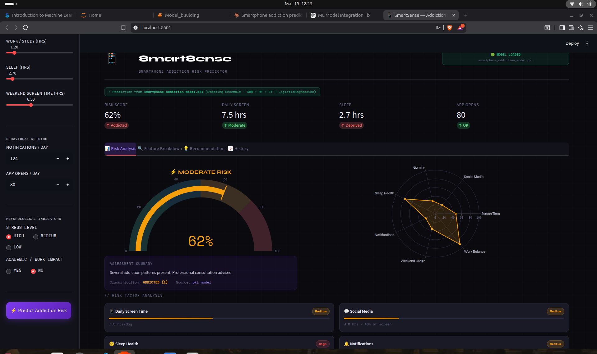

# 📱 Smartphone Usage & Addiction Risk Predictor

A **Machine Learning project** that predicts the likelihood of **smartphone addiction** based on behavioral smartphone usage patterns.

The model is built using a **Stacking Ensemble Learning approach** combining multiple tree-based models and a logistic regression meta-learner.

The project also includes a **Streamlit web application** that allows users to input behavioral data and receive a real-time addiction risk prediction.

---

# 🚀 Project Overview

Smartphone addiction has become a growing concern in modern society. Excessive usage can impact:

- Productivity
- Mental health
- Sleep quality
- Social behavior

This project builds a **machine learning classification model** that predicts whether a user is likely to develop **smartphone addiction** based on usage statistics.

The system analyzes multiple behavioral signals such as:

- Daily screen time
- Social media usage
- Gaming hours
- Notifications per day
- Sleep patterns
- App opening frequency

---

# 🧠 Machine Learning Model

The prediction model uses a **Stacking Ensemble Classifier**.

Stacking combines multiple models to improve prediction performance.

### Base Models

- GradientBoostingClassifier
- RandomForestClassifier
- ExtraTreesClassifier

### Meta Model

- LogisticRegression

### Model Workflow

```
Input Features
      ↓
Gradient Boosting
Random Forest
Extra Trees
      ↓
Logistic Regression (Meta Learner)
      ↓
Final Prediction
```

---

# 📊 Model Performance

The trained model achieved the following results:

| Metric | Score |
|------|------|
| Accuracy | **0.9393** |
| F1 Score | **0.9567** |
| ROC AUC | **0.9897** |

### Classification Report

```
              precision    recall  f1-score   support

           0       0.88      0.92      0.90       438
           1       0.97      0.95      0.96      1062

    accuracy                           0.94      1500
   macro avg       0.92      0.93      0.93      1500
weighted avg       0.94      0.94      0.94      1500
```

---

# 📂 Dataset

The dataset used for training was obtained from **Kaggle**.

It contains behavioral information related to smartphone usage.

### Dataset Characteristics

- ~7500 samples
- Behavioral usage metrics
- Binary classification target

### Example Features

```
age
gender
daily_screen_time_hours
social_media_hours
gaming_hours
work_study_hours
sleep_hours
notifications_per_day
app_opens_per_day
weekend_screen_time
stress_level
academic_work_impact
```

---

# ⚙️ Feature Engineering

Several derived behavioral features were created to improve model performance.

Examples include:

```
social_media_screen_ratio
gaming_screen_ratio
pickups_per_hour
sleep_deprivation_risk
high_social_media_usage
```

These features help the model understand **relative usage behavior rather than raw values alone**.

---

# 💾 Saving the Trained Model

After training the stacking ensemble model, the model was saved in two ways.

## 1️⃣ Saving the Raw Stacking Model (Pickle)

The trained stacking model was saved using Python's `pickle` library.

```python
import pickle

with open("smartphone_addiction_model.pkl", "wb") as file:
    pickle.dump(stacking_model, file)
```

This stores the trained stacking model as:

```
smartphone_addiction_model.pkl
```

However, this file contains **only the trained model** and does not include preprocessing.

---

## 2️⃣ Saving the Full Machine Learning Pipeline (Recommended)

To ensure preprocessing is applied during prediction, a **Scikit-learn Pipeline** was created.

The pipeline contains:

```
StandardScaler
+
StackingClassifier
```

### Creating the Pipeline

```python
from sklearn.pipeline import Pipeline
from sklearn.preprocessing import StandardScaler

pipeline = Pipeline([
    ('scaler', StandardScaler()),
    ('model', stacking_model)
])
```

### Training the Pipeline

```python
pipeline.fit(X_train, y_train)
```

### Saving the Pipeline

```python
import joblib

joblib.dump(pipeline, "addiction_pipeline.pkl")
```

This saves the complete workflow as:

```
addiction_pipeline.pkl
```

---

# 📦 Saved Model Files

After training, the following files are generated:

```
smartphone_addiction_model.pkl   → Raw stacking model
addiction_pipeline.pkl           → Full preprocessing + model pipeline
```

The **pipeline version is used for deployment**.

---

# 🖥️ Streamlit Web Application

The project includes a **Streamlit application** for interactive prediction.

Users can enter behavioral data and receive:

- Addiction risk prediction
- Probability score
- Risk category

---

# ▶️ Running the Application

## Clone the Repository

```bash
git clone https://github.com/yourusername/smartphone-addiction-predictor.git
cd smartphone-addiction-predictor
```

## Install Dependencies

```bash
pip install -r requirements.txt
```

## Run Streamlit App

```bash
streamlit run app.py
```

---

# 📁 Project Structure

```
Smartphone-Addiction-Predictor
│
├── app.py
├── addiction_pipeline.pkl
├── smartphone_addiction_model.pkl
├── dataset.csv
├── train_model.py
├── requirements.txt
└── README.md
```

---

# 🛠 Technologies Used

- Python
- Scikit-learn
- Pandas
- NumPy
- Seaborn
- Matplotlib
- Streamlit
- Joblib
- Pickle

---
## 📊 Dashboard Preview

This dashboard visualizes smartphone addiction patterns, usage distribution, and prediction insights.

<p align="center">
  
</p>

# 🔮 Future Improvements

Possible improvements to the project include:

- Deep learning based behavioral modeling
- Real-time smartphone usage data integration
- Explainable AI using SHAP
- Mobile app deployment
- Behavioral analytics dashboard

---

# 👨‍💻 Author

**Ravi Shankar**

Machine Learning & Data Science Enthusiast

---

⭐ If you found this project useful, consider giving the repository a star.
